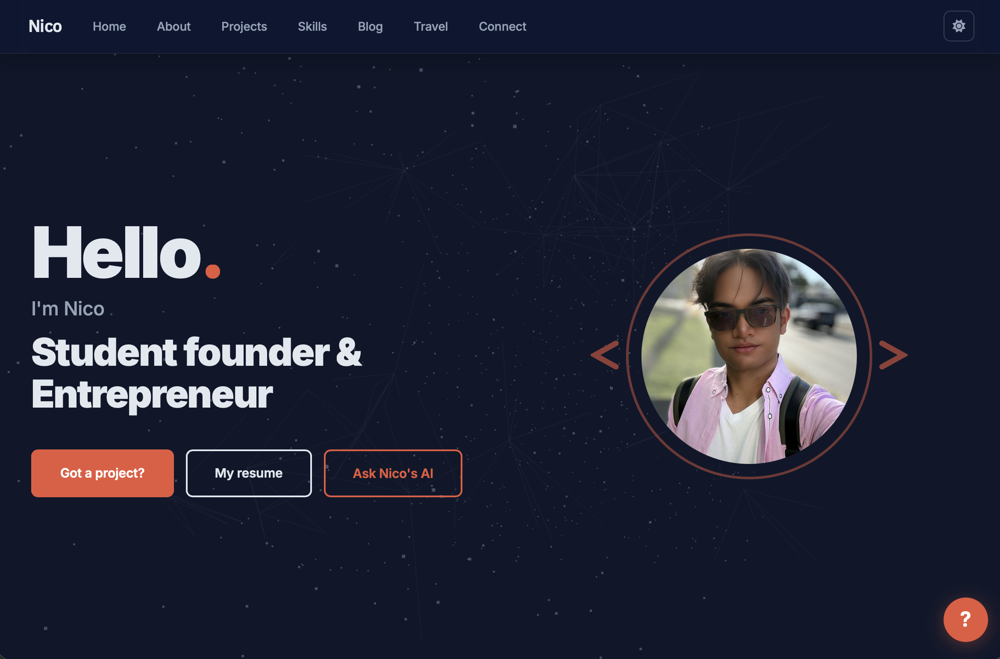
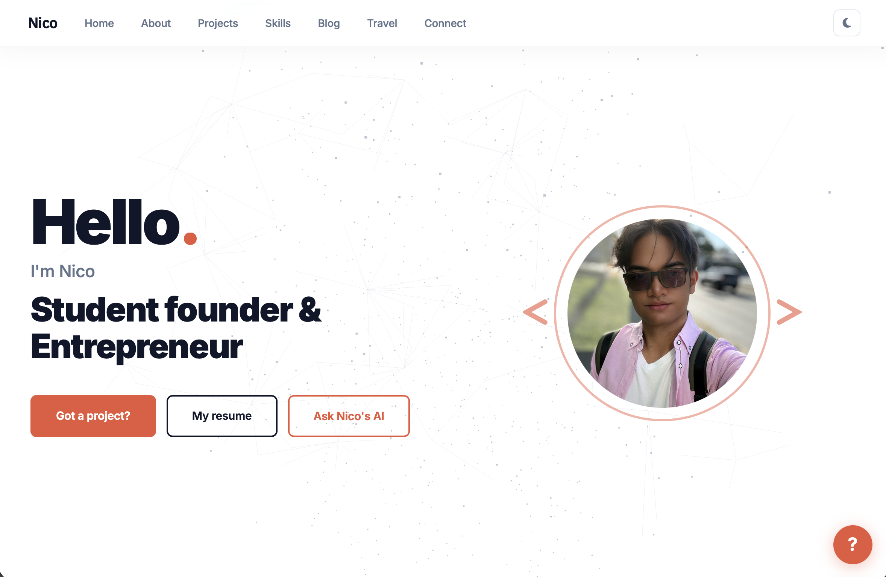

# Nico Ramos — Portfolio

Personal portfolio site for [itsnico.dev](https://itsnico.dev), built with **React + Vite** and plain CSS. No framework UI libraries, no Tailwind.

Live site: [itsnico.dev](https://itsnico.dev)

---

## Preview

| Dark Mode | Light Mode | Mobile |
|:---------:|:----------:|:------:|
|  |  |  |

---

## Stack

| Layer | Tool |
|---|---|
| UI | React 18 |
| Build | Vite 6 |
| Styling | Plain CSS (CSS custom properties, no framework) |
| 3D / Canvas | Three.js (hero particle animation) |
| Fonts / Icons | Google Fonts · Font Awesome CDN |
| Hosting | Netlify (auto-deploy from `main`) |

---

## Architecture

```
portfolio-webpage/
├── public/
│   └── img/                  # Static assets served at /img/
├── src/
│   ├── components/
│   │   ├── Navbar/           # Navbar.jsx + Navbar.css
│   │   ├── Hero/             # Hero.jsx + Hero.css
│   │   ├── About/            # About.jsx + About.css
│   │   ├── Projects/         # Projects.jsx + Projects.css
│   │   ├── Skills/           # Skills.jsx + Skills.css
│   │   ├── Blog/             # Blog.jsx + Blog.css
│   │   ├── Travel/           # Travel.jsx + Travel.css
│   │   ├── Contact/          # Contact.jsx + Contact.css
│   │   └── Footer/           # Footer.jsx + Footer.css
│   ├── hooks/
│   │   ├── useTheme.js       # Light/dark toggle with localStorage persistence
│   │   └── useScrollFade.js  # IntersectionObserver scroll-reveal animations
│   ├── App.jsx               # Root component — composes all sections
│   ├── App.css
│   ├── main.jsx              # React DOM entry point
│   └── index.css             # Global styles and CSS custom properties
├── blog/                     # Static markdown blog (separate from the React build)
├── netlify/                  # Netlify serverless functions
├── index.html                # Vite HTML entry
├── vite.config.js
├── package.json
└── netlify.toml              # Build: npm run build → dist/
```

Each component owns its styles — one `.jsx` and one `.css` per folder, no shared stylesheet between components.

---

## Getting started

```bash
# Install dependencies
npm install

# Start local dev server at http://localhost:5173
npm run dev

# Same as dev
npm start

# Production build → dist/
npm run build

# Preview production build locally
npm run preview
```

---

## Theming

Light/dark mode is driven by a `data-theme` attribute on `<html>` (`light` | `dark`). CSS custom properties defined in `src/index.css` switch values between themes. The active theme is saved to `localStorage` and applied before first paint (inline script in `index.html`) to prevent any flash.

---

## Sections

| Section | Component | Description |
|---|---|---|
| Nav | `Navbar` | Fixed glassmorphism nav, smooth scroll links, theme toggle, hamburger menu |
| Home | `Hero` | Three.js particle canvas, intro text, CTA buttons, tech ticker |
| About | `About` | 4-card grid covering education, expertise, entrepreneurship, and global mobility |
| Projects | `Projects` | Card grid of startup and course projects with badges and tech tags |
| Skills | `Skills` | Skill category cards (Frontend, Backend, Tools, Learning) |
| Blog | `Blog` | Featured post preview linking to the static `/blog` directory |
| Travel | `Travel` | Travel interest cards with Instagram link |
| Contact | `Contact` | Social links grouped by Work/Build and Follow |
| Footer | `Footer` | Dynamic copyright year |

---

## Blog

The `blog/` directory is a separate static site (plain HTML + Markdown). It is **not** part of the React build — it is deployed as-is alongside the built SPA.

**To add a new post:**

1. Create `blog/posts/<slug>.md` with your content in Markdown
2. Add an entry to `POSTS` in `blog/blog.ts`:
   ```ts
   {
     slug: 'my-post',
     title: 'Post Title',
     date: '2026-04-25',
     dateLabel: 'Apr 25, 2026',
     tag: 'Tag',
     excerpt: 'One sentence shown in the card.',
     readTime: '3 min read',
     counterKey: 'blog-my-post',
   }
   ```
3. Run `npx tsc` to regenerate `blog/blog.js`
4. Commit `blog/blog.ts`, `blog/blog.js`, and `blog/posts/<slug>.md`

---

## Deployment

Netlify auto-deploys from the `main` branch:

| Setting | Value |
|---|---|
| Build command | `npm run build` |
| Publish directory | `dist` |
| Functions directory | `netlify/functions` |

---

## Connect

**Professional**
- LinkedIn: [linkedin.com/in/nico-ramos28](https://www.linkedin.com/in/nico-ramos28)
- GitHub: [github.com/itsnicoramos](https://github.com/itsnicoramos)

**Personal**
- Instagram: [instagram.com/itsnicoramos__](https://www.instagram.com/itsnicoramos__)
- TikTok: [tiktok.com/@itsnicoramos_](https://www.tiktok.com/@itsnicoramos_)
- Threads: [threads.net/itsnicoramos__](https://threads.net/itsnicoramos__)
